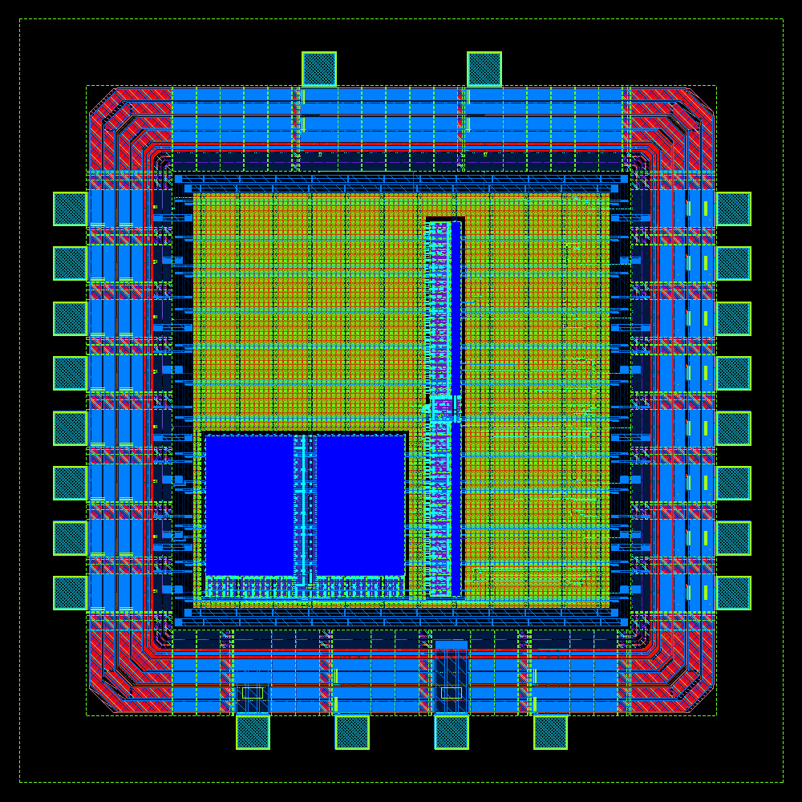
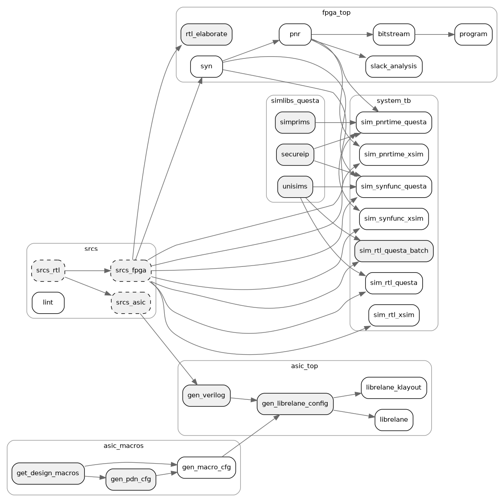

ORChiD
=====================
### *O*pen *R*apid *Chi*p *D*esigner

This repository contains a framework for generic hardware design projects.
It is designed to support Digital, Analog, Mixed-Signal and RF design via integration of multiple open-source projects and free software solutions:
- [LibreLane](https://github.com/librelane/librelane) for ASIC synthesis
- [IHP130-SG13G2](https://github.com/IHP-GmbH/IHP-Open-PDK) as an Open-Source PDK
- [ORDeC](https://github.com/tub-msc/ordec) for analog, mixed-signal + RF design blocks
- [KLayout](https://github.com/klayout/klayout) for viewing ASIC designs
- [NGSpice](https://github.com/ngspice/ngspice) for analog simulations
- AMD Vivado for RTL elaboration and FPGA development
- QuestaSim for RTL and netlist simulation

## Example Chip Render (KLayout)

The render is of a 1.6mm x 1.6mm minimal ASIC, containing two SRAM macros and a tiny amount of logic interfacing with the padring I/O. Its colors have been inverted for artistic effect.

## Flow Dependency Graph

Notable is the separation of FPGA and ASIC subgraphs, which ultimately depend on the same sources. The `asic_macros` block is to be extended in future versions to permit automated/integrated hardening of digital, but also analog/mixed-signal blocks into the design hierarchy. Simulations based on the ASIC toplevel (especially post-PnR timing-accurate simulations) are yet to be added.
